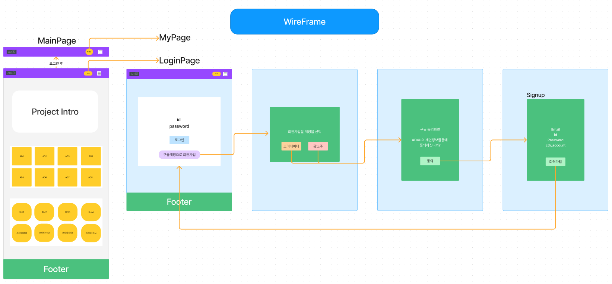
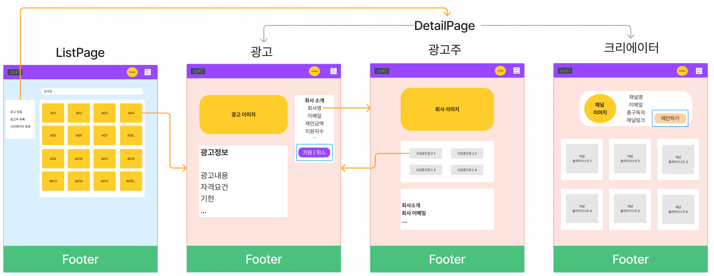
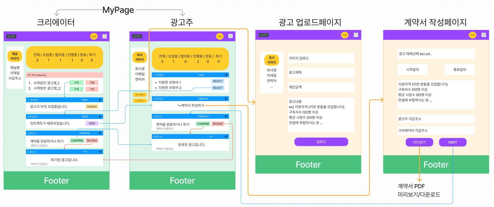
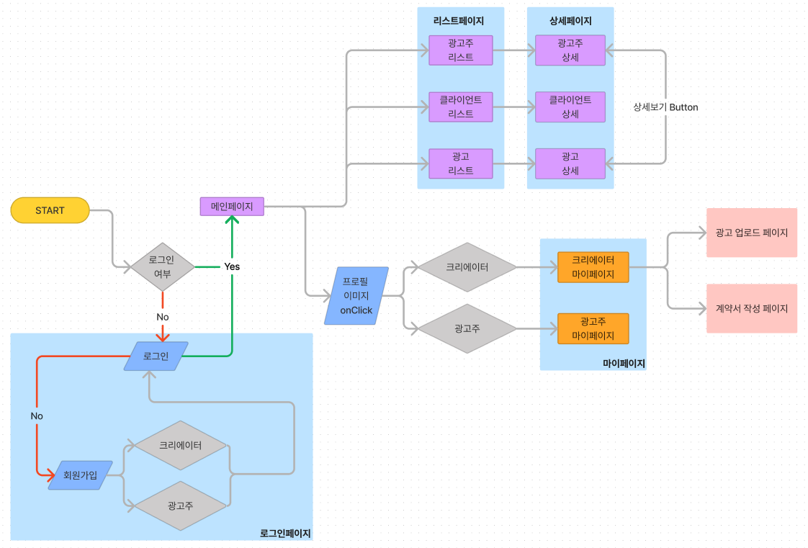

# Core Configuration

  

광고주가 크리에이터와 다중서명지갑을 생성하고 계약서를 생성한 후  
이를 다중서명지갑 구성원들의 Confirm과 Revoke를 통해 계약을 마무리 짓는 전체 과정을 나타낸 그림입니다.
 
 

**광고주 : 계약 생성(1)**

광고주는 크리에이터의 Address와 자신의 Address를 가지고, MultiSig Wallet을 생성합니다.

- 이때, 광고주는 Multisig Wallet의 Owner가 되며, 크리에이터의 Address는 Owner 후보에 등록됩니다.
- 여기서 Owner는 해당 계약인 Multisig Wallet의 참여자를 말하며, 광고주와 크리에이터 모두가 Owner가 되어야 계약을 진행할 수 있습니다.
 
 

**크리에이터 : 계약 참여 및 서명(3)**

크리에이터는 광고주로부터 전송받은 Multisig Wallet에 접근하여 서명함으로써 계약 참가를 알립니다.

- 이때, 크리에이터는 Owner 후보에 등록되어 있어야 하며, 정상적으로 서명이 진행되었을 경우, 크리에이터 또한 Owner에 등록됩니다.
- 크리에이터가 계약에 참여하지 않는다면, 광고주는 다음 과정인 계약 정보를 등록할 수 없습니다.
 
 

**광고주 : 계약서 작성(4)**

광고주는 크리에이터와 협의된 계약서를 작성하고 암호화된 계약 정보를 체인에 저장, 계약금을 예치합니다.

- 이때, 광고주가 작성한 계약서는 암호화 진행후, 크리에이터에게 SBT 형태로 발행됩니다.
 
 

**광고주, 크리에이터 : 계약 완료 or 계약 파기(5, 6)**

계약 완료

- 완료는 광고주와 크리에이터가 4번 과정의 계약 내용에 대해 성실히 이행됨을 확인하고, 해당 계약을 성공적으로 종료하는 것입니다.  
이에 광고주와 크리에이터 모두 4번 과정의 계약 정보에 Confirm을 함으로써, 해당 계약 정보의 Confirm 횟수가 2회가 되면, 
예치금은 자동으로 크리에이터에게 전송됩니다.

계약 파기

- 파기는 광고주나 크리에이터 둘 중 한 사람이라도 계약에 대해 마찰이 생겨 계약을 파기해야할 경우, 한 명이라도 4번 과정의 계약 정보에 대해 Revoke를 하게 되면, 그 즉시 계약 파기로 간주하고 예치금은 광고주에게 다시 전송됩니다.
    - 이 때, 계약서(SBT)는 파기되지 않습니다.
 
 

# Wire Frame

  
  
  

 
 

# Work Flow
 

 ### frontend
  

    
  

 

1. 로그인 여부를 확인하여 Nav의 구성이 바뀝니다.
    - 로그인되어있지 않은 경우, 프로필 이미지 대신에 로그인 버튼이 활성화가 됩니다.
    - 로그인 여부는 LocalStorage의 로그인 데이터의 유무로 판단됩니다.
    - 리프레쉬 쿠키가 있는 경우, refresh API에 의해서 로그인정보를 서버로부터 받아오고 로그인 상태로 변경됩니다.

2. 로그인 되어있지 않은경우, 크리에이터 또는 광고주 계정으로 로그인 할 수 있습니다.

3. 회원가입 해야하는 경우, 서버로부터 구글 OAuth 주소를 받아오고 동의화면으로 이동됩니다. 
    - 개인정보 이용동의를 마친 후, authorization code를 서버로 전송하고 구글 email를 받아옵니다.
    - 회원가입 modal를 통해 추가적인 유저정보를 입력하여 서버로 전송하면 회원가입이 완료됩니다.

4. 메인페이지
    - AD4U 프로젝트의 대한 Intro를 확인할 수 있습니다.
    - AD4U를 통해 배포(Deploy)된 모든 Multi-Sig Wallet의 수수료 거래량을 확인 할 수 있습니다.
    - 광고, 광고주, 크리에이터에 대한 최신목록을 대략적으로 확인가능합니다.

5. 리스트페이지
    - 광고, 광고주, 크리에이터에 대한 전체목록을 확인 할 수 있습니다.
    - 검색창을 통하여 필터링을 할 수 있습니다.
    - 광고, 광고주, 크리에이터 카드를 선택하여 상세페이지로 이동할 수 있습니다.

6. 상세페이지
    - 해당 광고, 광고주, 크리에이터에 대한 상세 정보를 확인할 수 있습니다.
    - 광고주는 크리에이터 상세페이지에서 광고를 제안(Propose)할 수 있습니다.
    - 크리에이터는 광고 상세페이지에서 지원신청(Apply)을 할 수 있습니다.

7. 마이페이지
    - 광고주 마이페이지
        - 회사의 정보를 확인하고 modal을 열어 회사정보를 수정할 수 있습니다.
            - 첨부된 회사 이미지 파일은 AWS S3에 올리고 Img_URL을 받아 서버로 전송합니다
        - 광고 업로드 페이지로 이동하여 광고를 업로드 할 수 있습니다.
            - 첨부된 광고 이미지 파일은 AWS S3에 올리고 Img_URL을 받아 서버로 전송합니다.
        - **모집중**인 광고에서 크리에이터를 선택(Select)하여 Multi-Sig Wallet 배포(Deploy) 할 수 있습니다.
        - **진행중**인 광고에서 계약서 작성페이지로 이동할 수 있습니다.
            - 광고주는 계약서 작성페이지에서 최종적으로 협의된 계약서를 IPFS에 업로드하여 Token_URI를 발급받고 SBT Token을 Mint할 수 있습니다.
        - **진행중**인 광고에서 컨펌(Confirm) 또는 파기(Revoke) 할 수 있습니다.
        - **진행중**, **완료**, **파기**된 광고의 계약서를 다운받을 수 있습니다.
    - 크리에이터 마이페이지
        - 회원가입시 등록한 지갑주소(Account)를 확인할 수 있습니다.
        - 제안받은 광고에서 제안(Propose)은 수락 또는 거부 할 수 있습니다.
            - 제안을 수락하면 해당 광고를 지원신청(Apply)한 상태가 됩니다.
        - **모집중**인 광고에서 지원취소(Cancel)을 할 수 있습니다.
        - **협의중**인 광고에서 Multi-Sig Wallet에 서명(Sign) 할 수 있습니다.
        - **진행중**인 광고에서 컨펌(Confirm) 또는 파기(Revoke) 할 수 있습니다.
        - **진행중**, **완료**, **파기**된 광고의 계약서를 다운받을 수 있습니다.

# Technical-Stack

  Frontend
   
  
  
   
  
   
  
   
  
  
  
   
  
  
  

 

  Backend
   
   
   
  
   
  
  
   
  
  
   
  
  
   
  
  

 

  Blockchain
   
  
  
  

 

  Collaboration Tool
   
  
  
   
  
  

 
